# UJS web
>  模仿江苏大学信息门户做的一个交流平台

## 数据库

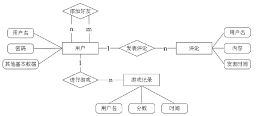

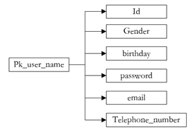

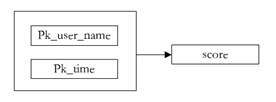

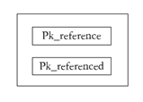

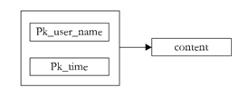

## 开发环境

- 前端：
  - Vue作为前端项目框架
  - Vue-Cli作为项目环境搭建
  - Vue-router作为前端路由实现页面无缝跳转
  - VueX做状态管理用于实现注册登录
  - Axios用于进行REST风格的HTTP请求
  - UI库使用Bootstrap4
  - 前端服务器采用Nginx用于反向代理和负载均衡
  - 端口号：8081

- 后端：
  - SpringBoot作为后端框架
  - Mybatis链接并操纵数据库
  - 使用REST风格设计接口
  - 使用Postman做接口测试
  - Tomcat作为后端服务器
  - 端口号：8080

- 其他：
  - 使用MySQL数据库
  - Postman做接口测试

## 项目展示

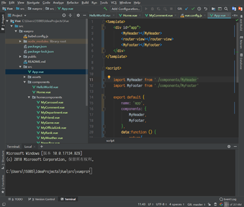

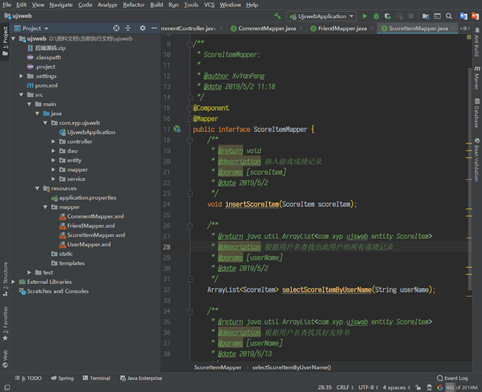

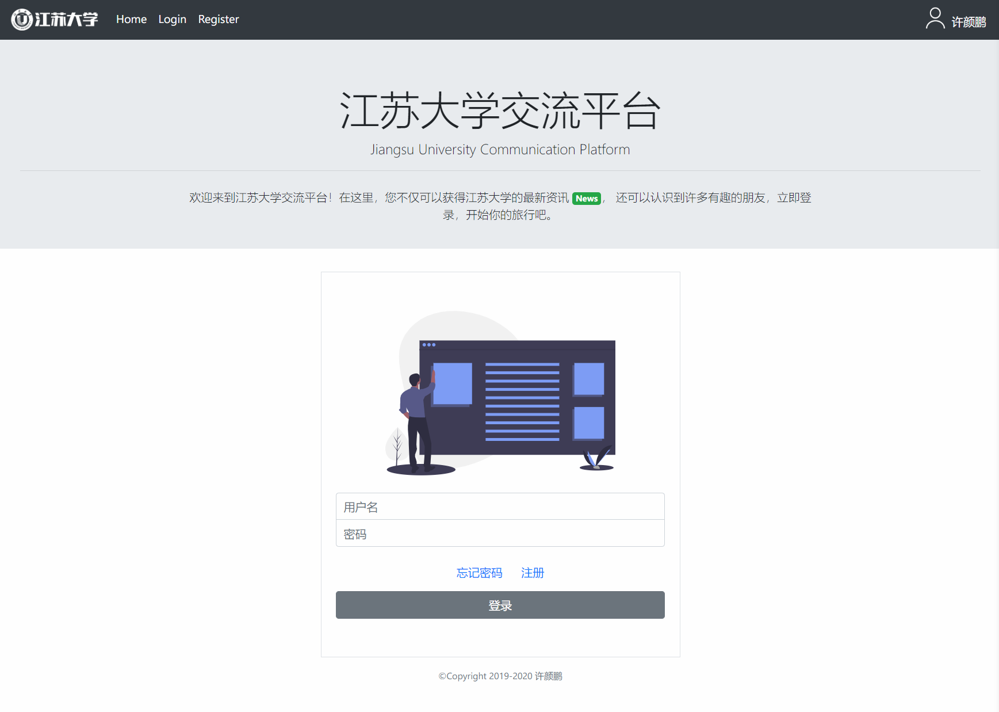

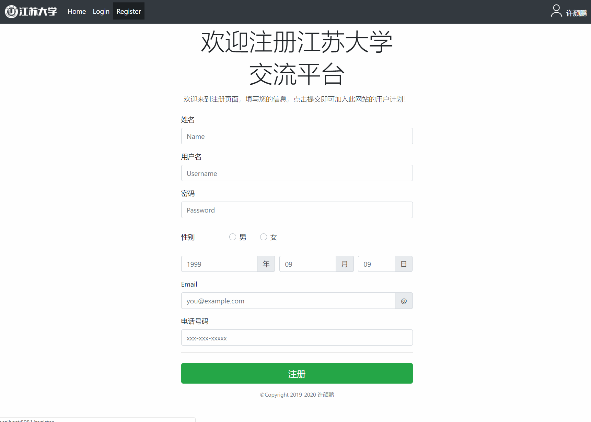

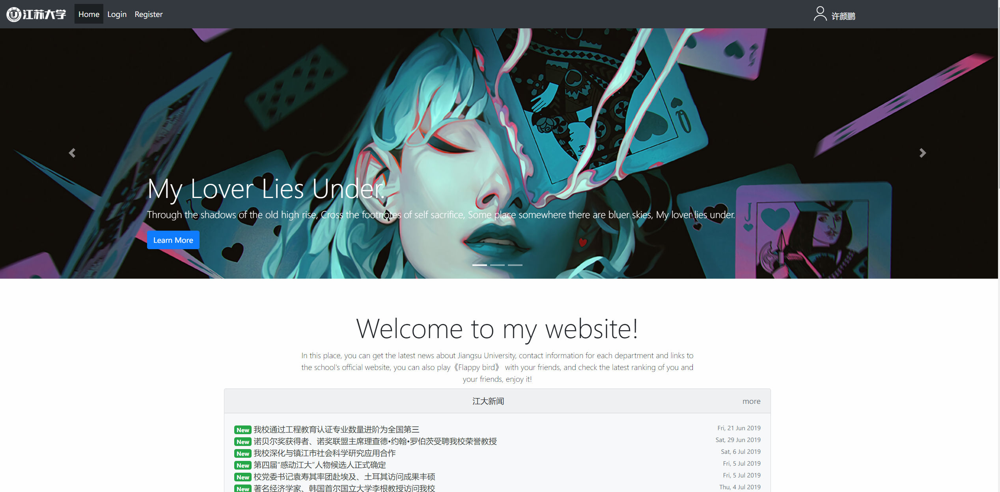

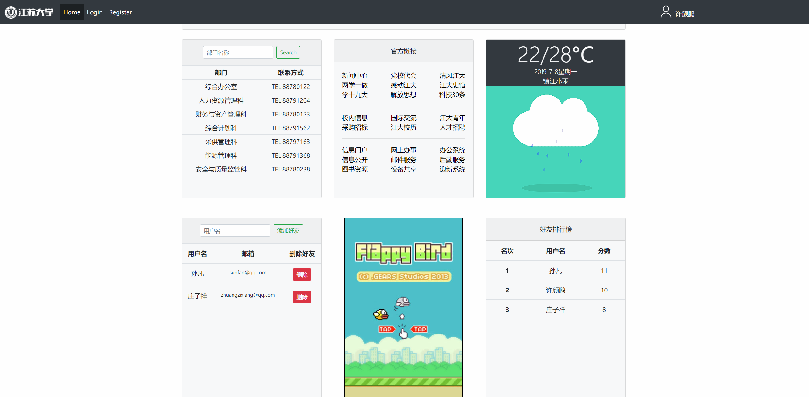

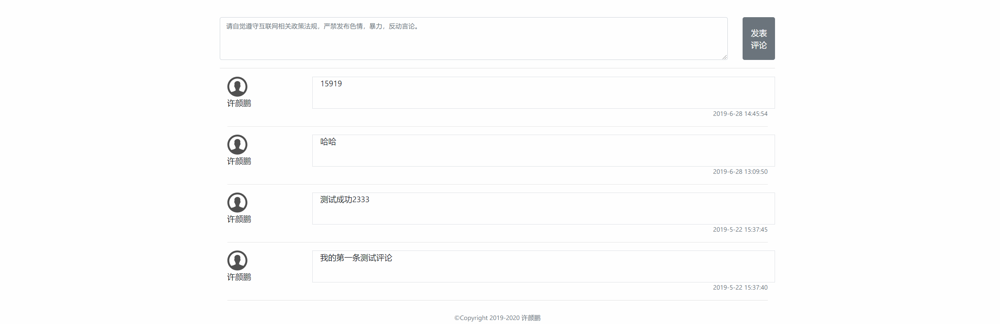